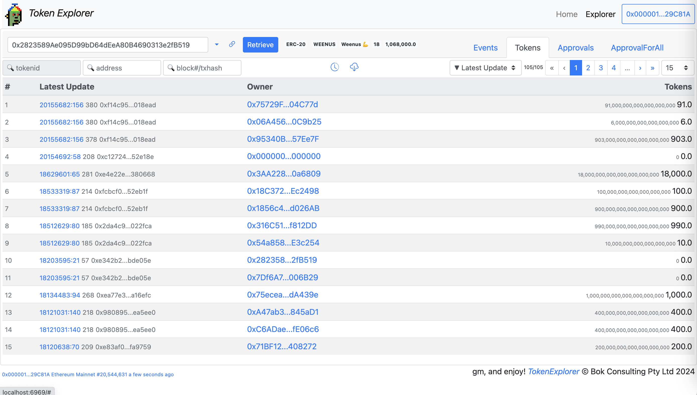

# ERC-20, ERC-721 and ERC-1155 Token Explorer

https://bokkypoobah.github.io/TokenExplorer/

##### Requirements
* Web browser, with the MetaMask https://metamask.io/, or Rabby https://rabby.io/ browser plug-in

 

---

#### Screenshots

##### Opening Page
<kbd></kbd>

##### Select Contracts

Enter an ERC-20, ERC-721 or ERC-1155 token contract address, or select one from the sample list.

<kbd></kbd>

##### ERC-20 Events

All `Transfer(from, to, tokens)` and `Approval(owner, spender, tokens)` events.

Using the `0x2823589Ae095D99bD64dEeA80B4690313e2fB519` WEENUS contract.

<kbd></kbd>

##### ERC-20 Tokens

Token balances

<kbd></kbd>

##### ERC-20 Approvals

Latest `tokens` approved for each (`owner`, `spender`) pair

<kbd></kbd>

##### ERC-721 Events

All `Transfer(from, to, tokenId)`, `Approval(owner, spender, tokenId)` and `ApprovalForAll(owner, operator, approved)` events.

Using the `0x42069ABFE407C60cf4ae4112bEDEaD391dBa1cdB` CryptoDickButts contract.

<kbd></kbd>

##### ERC-721 Tokens

All tokens

<kbd></kbd>

##### ERC-721 Approvals

Latest spender for each (`owner`, `tokenId`) pair

<kbd></kbd>

##### ERC-721 ApprovalForAlls

Latest `approved` for each (`owner`, `operator`) pair

<kbd></kbd>

##### ERC-1155 Events

All `TransferSingle(operator, from, to, tokenId, value)`,
`TransferBatch(operator, from, to, tokenIds, values)` and
`ApprovalForAll(owner, operator, approved)` events.

Using the `0xB32979486938AA9694BFC898f35DBED459F44424` Nyan Cats contract.

<kbd></kbd>

##### ERC-1155 Tokens

All tokens

<kbd></kbd>

##### ERC-1155 ApprovalForAlls

Latest `approved` for each (`owner`, `operator`) pair

<kbd></kbd>

##### ERC-721 and ERC-1155 Token Details
<kbd></kbd>

##### Token Id Filter
<kbd></kbd>

##### Address Filter
<kbd></kbd>

 

 

Enjoy!

(c) BokkyPooBah / Bok Consulting Pty Ltd 2024. The MIT Licence.
